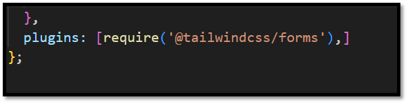

# log-project

I decided to continue using Tailwind for my CSS Library, as this utility-first framework consists of more customizable classes so I can style my own components. While having considered Boot-strap earlier, I felt this might be more based on pre-designed components and other elements such as buttons, navbars and layouts. 
A previous challenge in projects similar to this, is the deployment process. Since we are using the gitlab pages deployment, I was not entirely sure how that would work. Gitlab uses .yml files for the deployment process, and it might be that I need to create a script for this at some point. 
Tailwind does require a build process, as it takes the tailwind styles and whatever I might add as custom styles and uses this to generate the final CSS file. Once the final file is built this is the one being used by our markup. Creating a script in the package.json file that outputs a style.css could be an option, and also something that we could consider to include in the .gitlab-ci.yml file for the gitlab deployment, and additionally make these processes point towards a public folder within my root structure to gather the necessary files for deployment. 
After initializing a project in a new directory named log-project, I installed vite, tailwindcss, postcss and autoprefixer using NPM. Following the tailwind documentation, I initialized tail-windcss using NPX. At this point I had both the package.json for the node project and the tail-wind config file as tailwind.config.js.

## 11.1	Project Catalogue Structure
After some testing I did find a folder structure that supported some clarity for my own benefit, compartmentalizing some files but not uneccesarily complicated. The folderstructure can be seen below (fig. 1)

![Filestructure]readme-images/Picture1.png)

At this point I created a test page to test deployment, to make sure the configurations did not initially had problems (fig. 2).

## 11.2	Changes to the initial prototype
When I initially started thinking about the plan I had an idea about creating a learning log where I could write articles, mostly for my own benefit from a design perspective as well as a toolbox and archive for later use. A couple years ago I also saw a navigation model I thought were intriguing, where the layout was very text based and clean, and had a colorful object in a corner bringing some focus to the navigation. I wanted to incorporate something similar to this, and navigate it in accordance to the animations and SVG opportunities we have seen through the exercises. However, after a couple weeks of testing different designs and ideas I still did not come up with designs I felt was as I wanted it to be. In most tests it seemed more of a nuisance and distraction rather than a point of interest. 
While the example I saw years ago were very different in some ways, it was more like a visual notebook/pen and paper, the main idea I wanted was ”keep it simple, stupid”. I have always had a tendency to add too much, with too little focus on spacing, sizing, and the hero section. The goal for the final project was to create a practical website, that would be easy to navigate, be responsive to all devices from mobile to large screens and resolutions. Lastly but not least, a website that made the user easily can get information, understand layout and wants to navigate through. 
## 11.3	The main layout
I decided to go with a horizontal top navigation on desktop, as seen in the figure 3 below. An aspect I wanted to keep was little distractions or background noice, and the logo was created with an ascii generator. While this image was not the most responsive, I liked the very simple look and it fit into my idea of clean and an easy color-palette. I added some more colorful tags to get some more colors, which at the same could have functionality to categorize articles. The actual functionality has not been added as it would require more actual articles, and probably be most easy to complete by setting up a database that contain the servers so they can more easily be fetched on search and selections. 

. 

For smaller screens, the mobile navigation was the first one added to the page, and while it did have a bit different view than the main page I did like how it turned out and the functionality without being too advanced, and different than the 200 hamburger menus I see on a daily basis. I wanted to have a sidebar style of navigation, but I felt it was important to keep the text in the menu as I have seen lectures where despite many icons being clear, most people are not sure without the text. I also added the names to the social medias in the footer for this reason. 
The layout design for the mobile menu was based on a guide by Fireship (https://youtu.be/pfaSUYaSgRo?si=IQ3onKWwUffZHUTn). I felt this was a really challenging and good way to start the project, as it did use tailwind. However, the guide used react and had a different setup of the project and parts of the navigation so I did not follow the guide but mostly use the classes for inspiration and a guideline for how it could be put together (fig. 5). 

## 11.4	Other pages
For the recent articles page, I wanted to showcase the articles in smaller article styled cards, but with enough information to catch the interest of the reader (fig. 6). Using a grid layout made it much easier to keep the page responsive. Initially I wanted to make use of an ordered grid, but on testing the different layouts and using spans for the top most recent article, I decided to keep it as is. If I had more time for the project, I would change it to order as the other pages. As the cards below were equal  in content and size, I did not feel the need to be able to move certain cards around to different locations, and the general flow on smaller screens followed nicely. 

For the archive page, I wanted a clean simple layout that had a bit more options than the first. The first one is ment only to show the most recent ones, despite having a ”load more” option. I also wanted to explore what options there are for tailwindcss, as so far while I am getting more and more used to using tailwinds classes, there are things of classic CSS or SCSS that would make things a bit easier to manage. For example for grid orders to add ”.” instead of a full empty div that I hid. When looking for components there were a plethora of different sites out there, but the one I looked at the most was probably https://tailwindui.com/components and https://www.creative-tim.com/. From the latter I did find a nice clean component I wanted to make use for the archive page: https://www.creative-tim.com/twcomponents/component/blog-page
A lot of time was spent to change and make this component into something that would fit my log-archive. I added categories on the sidebars (but hiding them on medium/small screens), as well as option to browse and a dropdown for newest and oldest. While the actual functionality doesnt work as I have not focused on the backend at all, the idea is there to be shown (fig. 29).

For the final about page, I decided to have a personal touch, and since this is not publicly available I did not consider the contents too hard but still wanted mostly to have some information that is still nice to read and hopefully does not bore the reader to switch to another website. I did go back to the main page as well as the about page and used order to move things around, and once I got back into that it was really rewarding and easy to see how to place objects. I did add a picture I liked to have some options to use for example more picture options as we have been through in the exercises so far, but at the same time I had a focus on creating something clean and that would fit the purpose of the page (fig. 30).

In the core CSS file I added some default styles as well as testing @apply on the tags to see how it worked. I also used the tailwindcss config as shown to to the right in the figure to add my own custom class values (fig. 31).

Additionally the plugin i used had some custom styling resets for the form elements, so added the forms plugin (fig. 32). I did have to consider the framework and configuration files throughout the project, as adding new files and paths, changing folders and similar, gave some challenges that I had to figure out, like adding new pages so they would get picked up by vite to be sent to distribute folder, as I did not want to have those as static files in the public folder. Eventually, I did the final build command/ (fig. 33). 
, which pushed the final version to the gitlab deployed pages - not publishing it via github as only the code is available here. 

 //

For the final thoughts of the learning diary, I have gained a more in-depth understanding of modern web visualization techniques and tech, specially in the meaning of how to structure, style, and a bit of optimization of websites both for user experiences and functionality in mind. 
I have used semantic elements before, but more concise so now. Recognizing how proper structure and semantic tags improve readability and maintainability, and accessability. When it comes to CSS layouts using particularily grid,  I have gained considerably more knowledge. Even though the final project was created slowly throughout some heavy impact from other courses, I was happy with the end result moreso than previous projects. Being able to consider responsiveness in a whole new light of ”easy” is great, instead of ignoring small things that might not in reality be that hard to change. 
Typography have been a big part of the exercises and guides, like the best-practice list, that I keep going back to to check. Understanding the impact of font choices, spacing and line length on readability and how it looks. Animations were interesting to dive into, and I feel I would have wanted to use more animations and keyframes in my final project, at the same time I felt it did not fit with the ideas I had. 
Lastly, for SASS and Tailwind, as I have never used either before – checking differences and how they can complement or replace the ways Ive done things before has been great. Testing components, implementing utility-first approaches, compartmentalizing projects in a different way than I have done before has been interesting. Additionally, I have gained more knowledge on how Gitlab works as that was my chosen deployment site, as I wanted every project in the same repository. I have had some hours checking the yml for the pipeline. 
For the new and challenging aspect, using more responsiveness in pictures did go beyond what I have seen before, setting optimization for devices in a nice way. Understanding how browsers chose images based on DPR and media queries were interesting. For TailwindCSS utility-first approach is useful but takes time to get into, the cheatsheet-pages out there helped out tons to find answers from traditional CSS. With SASS I spent quite some time and did research on troubleshooting build processes with tools like Vite, and updating configurations to seemingly simple things like @use and @import.

